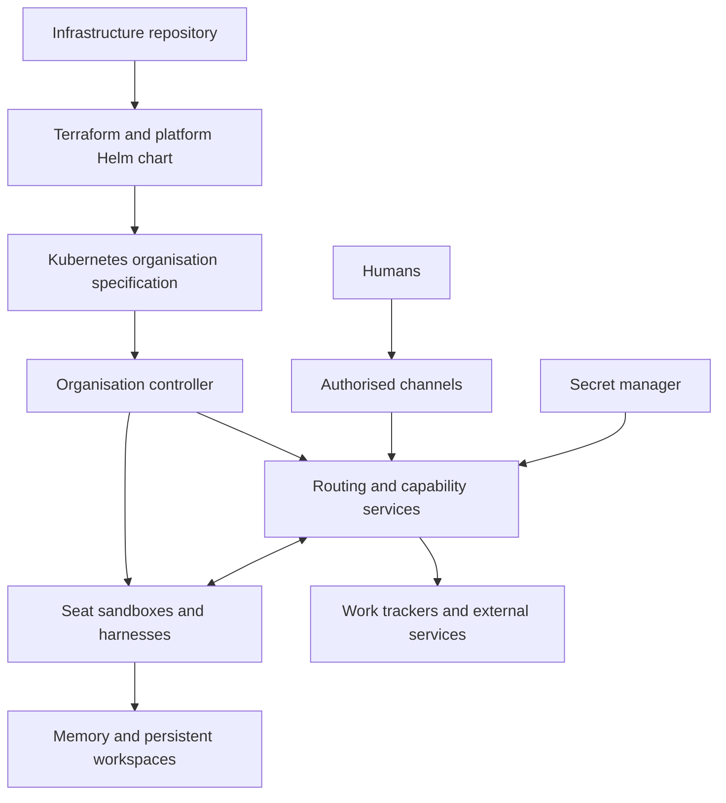
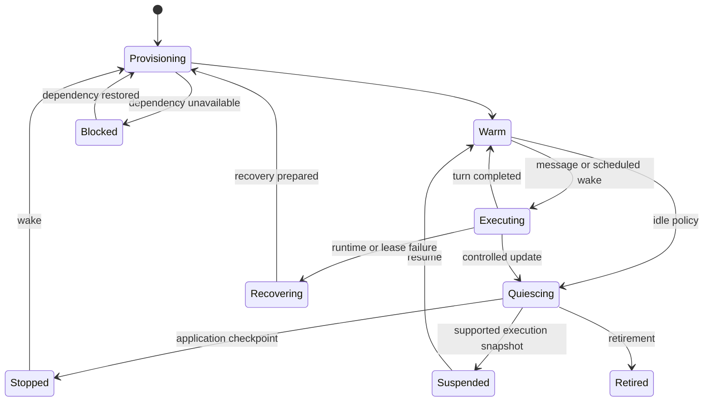

# Agent Organisation Platform

## Initial technical design and implementation handoff

Version: 0.1  
Date: 5 October 2026  
Audience: engineering agents and engineers implementing the platform  
Status: proposed architecture with agreed product requirements

## Contents

- [1. Outcome and delivery contract](#1-outcome-and-delivery-contract)
- [2. Architectural decisions](#2-architectural-decisions)
- [3. System structure and ownership](#3-system-structure-and-ownership)
- [4. Resource model](#4-resource-model)
- [5. Terraform interface and deployment workflow](#5-terraform-interface-and-deployment-workflow)
- [6. Kubernetes reconciliation and seat lifecycle](#6-kubernetes-reconciliation-and-seat-lifecycle)
- [7. Harness integration contract](#7-harness-integration-contract)
- [8. Memory and context](#8-memory-and-context)
- [9. Communication and representatives](#9-communication-and-representatives)
- [10. Connectors and secret access](#10-connectors-and-secret-access)
- [11. Sandbox backends and reference systems](#11-sandbox-backends-and-reference-systems)
- [12. DSec informed compute management](#12-dsec-informed-compute-management)
- [13. Persistence and internal APIs](#13-persistence-and-internal-apis)
- [14. Observability and operational controls](#14-observability-and-operational-controls)
- [15. Repository organisation and packaging](#15-repository-organisation-and-packaging)
- [16. Build plan](#16-build-plan)
- [17. Acceptance criteria](#17-acceptance-criteria)
- [18. Decisions the build agent must record](#18-decisions-the-build-agent-must-record)
- [19. References](#19-references)

## 1. Outcome and delivery contract

Build a platform that creates a working organisation of persistent agents from an infrastructure repository. An operator describes its culture, teams, seats, harnesses, memory, tools, communication routes, and external connections. Applying that configuration provisions the organisation on Kubernetes. Once deployment reports success, authorised people can contact their representatives through the configured channels and receive responses. Shared work systems expose the projects and activity the agents produce.

The acceptance target is a working communication path and persistent agents, rather than the mere presence of Kubernetes objects. The platform must translate the declared organisation into all required workloads, storage, identities, permissions, routing, and configuration. No manual shell command to launch an agent after a successful deployment is part of the intended workflow.

The first release must support this sequence:

1. Supply an existing cluster or provision one through the surrounding infrastructure repository.
2. Install the platform and establish authorised external integrations.
3. Apply an organisation definition with at least two human representatives and an engineering team.
4. Receive connection details and an explicit organisation readiness result.
5. Message a representative, have it consult persistent context and delegate work to another seat, and receive a response.
6. Observe an agent-created project or task in a connected work tracker.
7. Restart the workloads and continue using the same seats and durable information.

Terraform is the desired interface. The proposed provider name `agentorg`, API identifiers, file paths, and schemas in this document are design examples to implement; they are not an existing published provider. An implementation may refine their syntax while preserving the contracts below.

### 1.1 Agreed requirements

- A seat is a continuing identity with durable state. Starting a process activates that seat. Replacing its sandbox does not create a new colleague.
- Team definitions are reusable and can specialise a general team definition. Engineering and accounting are examples of specialisations.
- Culture and working frameworks are shared instruction resources. They can apply at organisation, team, or seat scope.
- Agents decide how projects are formed, coordinated, reviewed, and considered complete. These management choices belong to their instructions and behaviour.
- Each human can have a personal representative with a continuing conversation history. Normal human operational input goes through representatives.
- Representatives understand intent, ask useful questions, advocate internally, delegate, follow through, and learn suitable reporting preferences.
- Agents may perform any action supported by their granted capabilities. There is no platform-wide rule requiring human approval of every external action.
- Organisation structure changes through its infrastructure source and deployment workflow when agents have been granted access to those systems.
- Memory is available through tools. Agents manage the content and organisation of their accessible memory.
- Harnesses are selectable and replaceable. Durable seat identity and platform memory must survive a harness change.
- Sandboxes, secret access, tool permissions, and resource allocation are enforced by infrastructure and trusted services outside agent control.

### 1.2 Scope boundaries

The platform provisions and operates participants, context, execution environments, and capabilities. It does not prescribe a CEO, a mandatory project owner, an approval chain, a task-planning algorithm, or a definition of business success. Templates may express these choices without turning them into universal controller logic.

Projects and tasks are runtime business records in external work systems. They are not Terraform resources in this design. A platform execution record describes the technical handling of a message or wake event; it does not dictate the lifecycle of the corresponding business project.

Cloud cluster provisioning, organisation-specific GitHub deployment permissions, and external account ownership remain concerns of the surrounding infrastructure repository. The platform must integrate with them through documented inputs. A banking connector is a possible future capability, not a required initial implementation.

## 2. Architectural decisions

The following decisions provide a concrete starting point. They are implementation proposals unless already identified as agreed requirements.

| Decision | Initial choice | Reason |
| --- | --- | --- |
| Desired-state API | Kubernetes custom resources | Use the existing cluster API and reconciliation model. |
| Terraform interface | A thin custom provider managing an aggregate organisation resource | Provide a useful plan and a deployment readiness contract without putting continuous runtime logic inside Terraform. |
| Initial custom resources | `AgentOrganization` and controller-owned `AgentSeat` | Keep the first API small; represent other domain objects as typed records in the organisation specification. |
| Runtime management | A continuously running organisation controller | Handle failures, wake-up, updates, and suspension independently of Terraform executions. |
| Trusted services | A small control-plane deployment with logical modules | Avoid requiring a separate microservice for every abstraction before workload measurements justify it. |
| Durable operational store | PostgreSQL | Store inboxes, execution metadata, revisioned memory, and connector operation records transactionally. |
| Files | Per-seat persistent volumes and an object store for larger artifacts and backups | Separate durable files from replaceable containers. |
| Secret custody | Existing Vault or an equivalent supported secret manager | Use runtime identity and secret references. |
| External interfaces | One communication adapter and one work-tracker adapter in the first usable release | Prove the complete user experience before broadening integrations. |
| First sandbox backend | Kubernetes-native container execution behind an adapter | Deliver the core lifecycle while retaining an integration path for Agentcontainers or Agent Sandbox. |
| Compute evolution | DSec-informed lifecycle and resource policies, introduced in measured phases | Preserve the architecture without assuming DeepSeek-scale performance on a different workload. |

Go is the proposed implementation language for the provider and Kubernetes controller, using the Terraform Plugin Framework and controller-runtime. Harness runners can use the language required by the selected engine. This is a practical default, not a requirement that every service be written in one language.

## 3. System structure and ownership



The diagram shows logical responsibilities. A first deployment can combine routing, the tool gateway, and execution coordination in one trusted service with separate authentication boundaries. Agents run in separate sandboxes. The controller and gateways must not execute arbitrary agent-authored code inside their own processes.

### 3.1 Configuration ownership

The provider owns the declared fields of an `AgentOrganization` object. The controller owns generated `AgentSeat` objects and their Kubernetes children. The controller writes readiness and operational status through status fields. Agents do not directly mutate those declarations through their normal runtime tools.

This ownership must be exclusive. Helm may install CRDs and controller software. In the recommended deployment path, it does not also own the organisation object managed by the custom provider. A Helm-only organisation installation is a supported alternative for a later release, with one owner chosen for each organisation. There is no simultaneous Helm and Terraform management of the same declared fields.

The provider never owns individual agent Pods or live replica counts. It requests the desired organisation and observes its convergence. The controller remains responsible for Pods after the Terraform process exits. Kubernetes operators and custom resources support this division. [R4]

### 3.2 State ownership

| Information | Authoritative location | Writer |
| --- | --- | --- |
| Organisation declaration | Versioned infrastructure source, applied to Kubernetes spec | Authorised deployment workflow |
| Observed readiness and effective revision | Kubernetes status | Controller |
| Seat identity and retirement record | Durable identity records linked to custom-resource identity | Controller |
| Inbound messages and pending wake events | Durable operational store | Authenticated ingress and runtime services |
| Personal and shared memory | Memory service and its backing store | Authorised agents through tools |
| Workspace files | Persistent volumes or explicitly supported remote filesystem | Authorised seat processes |
| Projects and tasks | Connected work tracker | Agents through connectors |
| Harness-native sessions | Harness-specific persistent storage | Harness adapter |
| External operation attempts and results | Connector operation ledger | Trusted connector service |
| Credentials | Secret manager or service-issued runtime credentials | Credential owner and authorised rotation process |

Terraform state contains management identifiers, declared values, and necessary computed outputs. It must not become a store for conversations, work artifacts, memory records, or raw credentials. Runtime data changes must not produce infrastructure drift.

## 4. Resource model

### 4.1 Organisation and stable identity

An organisation has a stable key, display name, namespace, instruction references, teams, seats, memory stores, profiles, connections, grants, message routes, and channel bindings. Its control-plane namespace is established by the infrastructure repository before the organisation is applied.

Each seat has a stable key within its organisation and a controller-assigned immutable identity. Changes to its display name, instructions, or execution image preserve that identity. Changing the key is an explicit rename or migration operation; an accidental map-key change must not silently abandon its data and introduce a replacement identity.

The platform records immutable organisation and seat IDs alongside Kubernetes UIDs. Human-readable names are not authentication evidence. Deleting a seat and creating a new seat with the same name does not automatically grant the new identity access to retained private data. Reattachment requires an explicit adoption operation authorised by infrastructure configuration.

### 4.2 Teams and reusable templates

A team is a grouping of seats with instruction references and resource bindings. Seats can belong to multiple teams. Membership is declared on each seat; there must not be a second independently writable member list on the team.

A general team template can define shared workspaces, communication defaults, and role parameters. An engineering template can extend it with development and review roles. A concrete team instantiates that template with stable seat keys and project-specific resources. Accounting may use a different specialisation of the same base.

Compile templates before applying the organisation specification. The controller receives a concrete, resolved declaration rather than executing arbitrary template code. Terraform modules are the first implementation path. Helm library charts can package equivalent definitions where Helm is the selected declaration owner.

Template inheritance is a configuration feature; it is separate from container filesystem layers. Define merges explicitly: scalar defaults can be overridden, keyed records merge by stable key, ordered instruction lists preserve declared order, and permission grants remain explicit. Reject cycles and ambiguous conflicts. A template change must produce a reviewable Terraform plan showing the affected seats.

### 4.3 Instructions and culture

An instruction bundle is versioned text or a referenced artifact with an immutable revision or digest. It may describe culture, roles, working frameworks, representative behaviour, or tool-use guidance. Keep large documents outside the Kubernetes object and reference immutable bundles.

The resolved instruction manifest records each source, version, scope, and order. Its default ordering is organisation culture, team guidance in declared order, then seat-role guidance and task context. This ordering supports predictable composition; it does not make natural-language instructions a security boundary or guarantee an LLM will resolve contradictory guidance correctly.

Security permissions come from grants and runtime enforcement. Culture cannot widen them. Updates to culture use the configuration workflow; evolving observations and lessons normally enter memory. Agents may propose changes to culture through their authorised repository access.

### 4.4 Harnesses and execution profiles

A harness profile selects an adapter, pinned executable or image revision, model connection, startup configuration, and supported capabilities. An execution profile selects backend, CPU and memory policy, idle behaviour, wake triggers, and recovery policy. A sandbox profile defines filesystem, network, process, and tool-boundary restrictions.

These are independent selections. A seat may change harness without changing its memory grants, or change execution policy without changing its role. A requested combination must pass compatibility validation before any workload starts. Unsupported profiles fail explicitly; the controller must not substitute weaker isolation or silently ignore a requested suspension capability.

### 4.5 Connections, bindings, grants, and message routes

A connection describes access to a service, its adapter, authorised account or workspace, endpoint configuration, and secret references. It does not imply that every seat may use it.

An access grant binds a seat or team to allowed operations on a connection, memory store, or shared workspace. A message route permits a specified direction of communication between seats or groups. A channel binding maps a verified external account, user, conversation, or address to a representative seat and reply route.

Separate these records to avoid circular resource references. Multiple representatives can use one external application installation while remaining bound to distinct humans and private histories. The platform does not require a separate Slack application or external service account per person.

### 4.6 Resolved specification schema

The aggregate specification uses stable keyed records. The following minimum fields define the initial contract; provider validation and CRD validation must agree. References are checked within the organisation unless an explicitly authorised platform resource is named.

| Record | Minimum fields or required resolved values |
| --- | --- |
| Organisation | Key, display name, schema version, culture references, domain-record maps, data retention. |
| Team | Stable key and ordered instruction references; optional shared-resource bindings. |
| Seat | Stable key, role reference, ordered team memberships, harness profile, sandbox profile, execution profile, personal-memory binding, workspace binding. |
| Memory store | Stable key, retention policy, backing-store class, optional declared capacity. |
| Shared workspace | Stable key, storage reference or provisioning class, access modes, retention, and explicit grants. |
| Harness profile | Adapter, pinned runtime revision, model connection, supported configuration, required capabilities. |
| Sandbox profile | Filesystem and network policy, process restrictions, runtime class, required enforcement features. |
| Execution profile | Resource requests and limits, idle timeout, idle policy, service class, required lifecycle features. |
| Connection | Adapter, authorised service/account identity, endpoint configuration, secret references, ownership mode. |
| Grant | Subject, resource, allowed operations, optional target restrictions. |
| Message route | Sender, recipient or group, direction, reply semantics. |
| Channel binding | Connection, verified human mapping, representative seat, conversation/reply configuration. |

Defaults must be versioned and visible in the effective manifest. Required security and resource settings cannot silently inherit permissive cluster defaults. A shared workspace requires an access mode supported by its storage backend; team membership alone does not imply shared filesystem access.

## 5. Terraform interface and deployment workflow

### 5.1 Initial aggregate resource

Implement `agentorg_organization` as the first provider resource. It accepts a typed specification containing keyed maps of domain records. The provider writes one `AgentOrganization`; the controller creates and maintains its children. This gives the first implementation one convergence boundary and avoids cross-resource readiness cycles.

The provider schema must expose typed nested attributes rather than accepting only an opaque JSON string. Terraform should show meaningful changes to seats, access grants, profiles, and bindings. Granular resources can be added later if actual configuration size or ownership requirements justify them. Any split requires a state-migration strategy, not simultaneous writers.

The provider includes create, read, update, delete, import, timeouts, schema migrations, and clear diagnostics. The Terraform Plugin Framework supplies resource lifecycle integration; asynchronous readiness polling is provider logic to implement. [R5]

### 5.2 Illustrative organisation declaration

This is proposed HCL syntax, not executable configuration for an existing provider. The infrastructure repository supplies the referenced cluster, namespace, installed platform, pinned artifacts, service identifiers, and authorised secret-manager paths.

The example shows one representative and one reviewer to keep the interface readable. The complete acceptance fixture adds a second human and representative, organisation-memory grants, and any required shared-workspace bindings.

```hcl
terraform {
  required_providers {
    agentorg = {
      source  = "example/agentorg" # Placeholder registry address.
      version = "~> 0.1"
    }
  }
}

provider "agentorg" {
  kubeconfig_path = var.kubeconfig_path
  namespace       = var.organisation_namespace
}

resource "agentorg_organization" "company" {
  key          = "example-company"
  display_name = "Example Company"

  spec = {
    culture_refs = [var.culture_bundle]

    teams = {
      engineering = {
        instruction_refs = [var.engineering_bundle]
      }
    }

    memory_stores = {
      organisation = { retention = "retain" }
      engineering  = { retention = "retain" }
      rep_sean     = { retention = "retain" }
      reviewer     = { retention = "retain" }
    }

    harness_profiles = {
      primary = {
        adapter          = var.harness_adapter
        image_digest     = var.harness_image_digest
        model_connection = "model"
      }
    }

    execution_profiles = {
      interactive = {
        backend       = "kubernetes"
        service_class = "interactive"
        idle_policy   = "warm_then_stop"
        cpu_request   = var.seat_cpu_request
        cpu_limit     = var.seat_cpu_limit
        memory_request = var.seat_memory_request
        memory_limit   = var.seat_memory_limit
        idle_timeout   = var.seat_idle_timeout
      }
    }

    sandbox_profiles = {
      standard = {
        filesystem_policy_ref = var.filesystem_policy_ref
        network_policy_ref    = var.network_policy_ref
        runtime_class         = var.runtime_class
      }
    }

    connections = {
      slack = {
        adapter    = "slack"
        account_id = var.slack_workspace_id
        secret_ref = var.slack_secret_ref
      }
      tracker = {
        adapter    = "linear"
        account_id = var.tracker_workspace_id
        secret_ref = var.tracker_secret_ref
      }
      model = {
        adapter      = var.model_adapter
        endpoint_ref = var.model_endpoint_ref
        secret_ref   = var.model_secret_ref
      }
    }

    seats = {
      representative_sean = {
        role_ref          = var.representative_role
        harness_profile   = "primary"
        execution_profile = "interactive"
        sandbox_profile   = "standard"
        personal_memory   = "rep_sean"
        workspace         = { persistent = true }
      }
      reviewer = {
        role_ref          = var.reviewer_role
        teams             = ["engineering"]
        harness_profile   = "primary"
        execution_profile = "interactive"
        sandbox_profile   = "standard"
        personal_memory   = "reviewer"
        workspace         = { persistent = true }
      }
    }

    grants = {
      reviewer_tracker = {
        subject    = "seat:reviewer"
        resource   = "connection:tracker"
        operations = ["project.read", "project.create", "task.write"]
      }
      engineering_memory = {
        subject    = "team:engineering"
        resource   = "memory:engineering"
        operations = ["read", "search", "write", "revise"]
      }
    }

    message_routes = {
      representative_to_reviewer = {
        from  = "seat:representative_sean"
        to    = "seat:reviewer"
        reply = true
      }
    }

    channel_bindings = {
      sean = {
        connection       = "slack"
        external_user_id = var.sean_slack_user_id
        seat             = "representative_sean"
        mode             = "direct_message"
      }
    }
  }

  data_retention = "retain"
  wait_for_ready = true

  timeouts {
    create = "20m"
    update = "20m"
    delete = "20m"
  }
}

output "organisation" {
  value = agentorg_organization.company.connection_details
}
```

Selecting a personal memory store grants its owning seat the documented personal-memory operations; shared-store and external-action grants remain explicit. Selecting a model connection permits model inference through the harness adapter, not arbitrary access to that connection's credential. A channel binding permits its bound representative to reply through that binding. These narrowly defined implicit bindings must be visible in the resolved capability manifest and tested. No general network or service permission is implied.

### 5.3 Bootstrap ordering

An infrastructure repository should have distinct Terraform roots or equivalent stages for foundation, platform, and organisation. Foundation creates the cluster, networking, durable stores, namespaces, and secret-manager integration. Platform installs the controller and CRDs through Helm and waits for the management API to become available. Organisation applies the agent definition through the custom provider.

A repository-level `make apply` or CI workflow can execute these stages in order. It is a convenience wrapper around the existing tools, not a new infrastructure engine. On an already bootstrapped cluster, an ordinary organisation `terraform apply` is sufficient. Do not promise that fresh cluster creation, provider initialisation, CRD discovery, and organisation creation will all work in one undifferentiated first apply.

External account creation and OAuth installation may require an account administrator. Treat those as explicit prerequisites or supported provisioning steps, depending on each service. Terraform must not report the organisation ready while a required integration still needs someone to authorise it. The provider returns a clear blocked condition naming the unresolved binding or connection.

### 5.4 Success and readiness

`Configured` means the declaration was accepted. `OperationalReady` means the current generation has working storage, usable identities, compatible harnesses, enforced sandbox policies, authenticated required connections, durable message ingress, valid human mappings, and an executable route to each required seat. A stopped seat can be ready if the platform has verified it can wake and execute.

On create and update, the provider waits for the current generation's readiness when `wait_for_ready` is true. It exposes conditions and stable connection details. A timeout is an error with the existing resource identity preserved so the next refresh can recover; it must not trigger destructive cleanup of a partially created organisation.

A no-change Terraform apply is not a fresh end-to-end health test. The repository-level workflow therefore performs a readiness check after every apply. That check uses the platform API and a bounded synthetic execution probe. This preserves an honest success contract even when Terraform has nothing to update.

The readiness probe verifies connector authentication, routing, a harness tool call, persistence, and the outbound adapter. It must avoid creating real business work or sending unsolicited messages. A designated test conversation or adapter verification endpoint can exercise the external route; the first-user-message acceptance test covers actual conversation delivery.

### 5.5 Updates, drift, and deletion

Use a dedicated Kubernetes field manager for provider-owned specification fields. Do not force ownership over unrelated fields. Runtime status, generated children, live execution counts, and memory content do not participate in configuration drift. Server-side apply provides field ownership tracking; the provider still needs explicit conflict handling. [R6]

Instruction and profile changes produce a new desired revision. Apply them at a safe execution boundary, record the revision used by each turn, and report when all required seats have adopted it. Activate policy reductions in the trusted gateway before acknowledging the update as ready. Validate the current policy revision on tool calls and invalidate obsolete sessions. If a live sandbox cannot enforce the new boundary, quiesce or replace it before marking the update ready. An external operation already accepted by its destination cannot generally be cancelled or undone by revoking future access.

Removing a seat retires it: stop new delivery, settle or explicitly interrupt active work, revoke capabilities, detach routes, and preserve or remove data according to the declared retention policy. Default to retaining durable history and workspaces. Retention must survive owner deletion: do not give retained data a garbage-collecting owner reference to a retiring object. Use finalizers for bounded cleanup, with visible conditions and an audited administrative recovery procedure. [R7]

Infrastructure-level deletion of a namespace or storage backend can exceed this retention boundary. The surrounding repository must protect retained stores and use an appropriate volume reclaim policy. Organisation deletion does not delete existing Slack workspaces, external projects, or accounts unless their ownership and destruction policy were explicitly declared.

### 5.6 Provider correctness requirements

Treat authentication failures, unreachable clusters, and read timeouts as errors. Only a confirmed not-found response for the managed object means it has been deleted. A failed read must not erase Terraform state. Imports must verify organisation identity and ownership before adopting the remote object.

Preserve stable IDs across in-place changes and use framework state migrations when schemas evolve. Avoid perpetual diffs from controller-generated ordering, timestamps, or default values. Computed status is observed information and must not be written back into desired configuration.

Do not implement lifecycle management as untracked shell provisioners that run `kubectl` or an agent CLI. The provider must manage a durable API object with repeatable reads and recovery. Concurrent applies to the same organisation require a supported Terraform backend lock and server-side conflict detection; a Kubernetes field manager alone is not a distributed deployment lock.

## 6. Kubernetes reconciliation and seat lifecycle

### 6.1 Reconciliation sequence

Reconciliation is idempotent and driven by the desired generation. The controller validates references, compiles templates and instruction manifests, resolves capabilities, establishes durable identities, ensures storage, materialises seat declarations, and configures routing. It then provisions or verifies the selected execution backend and records conditions. Repeating these steps must converge without duplicating seats, volumes, channels, or external accounts.

The generated `AgentSeat` contains its immutable identity, effective configuration revision, profile references, workspace references, and effective tool manifest. It must contain no raw secret values. Generated names are deterministic and length-safe. Status includes observed generation, execution state, backend reference, latest checkpoint, current lease generation, readiness conditions, and a redacted last error.

Use namespace boundaries for organisational separation, explicit service identities for seats, default-deny network policy where supported, and declared resource quotas. Kubernetes namespaces alone are not complete isolation. The controller must verify that the selected networking and runtime components actually support required enforcement. [R8]

Agent Pods must not be able to create or modify Pods, custom resources, role bindings, or namespace policy. Access to organisation source code and CI is a separately granted external capability. A seat must not receive the controller's management credentials or host container-runtime socket.

### 6.2 Execution states

The following are technical execution states, independent of any project's business status.

| State | Meaning | Wake or recovery behaviour |
| --- | --- | --- |
| Provisioning | Identity, workspace, configuration, or backend is being prepared | Controller retries or reports a blocked condition. |
| Warm | Runtime is available with no active agent turn | Acquire a seat lease and dispatch queued work. |
| Executing | A harness is processing work under an execution lease | New messages are queued or delivered through a supported interrupt mechanism. |
| Quiescing | Runtime is completing a safe boundary and persisting recovery state | Stop accepting new turns; preserve pending work. |
| Suspended | Backend preserves execution state through a supported suspension mechanism | Resume the same compatible execution environment. |
| Stopped | Compute has been removed; durable application state remains | Recreate the environment and restore an application-level session. |
| Recovering | Runtime failed or a lease became invalid | Fence the old execution, inspect operation state, and restore safely. |
| Blocked | A required dependency or capability is unavailable | Retain messages and surface a reason; do not weaken restrictions. |
| Retired | Seat is removed from active organisation membership | Follow its retention and explicit adoption policy. |



The graph shows principal transitions; failures and retirement can be initiated from other states through the same recovery and cleanup contracts. Admission readiness remains a separate condition so an idle or stopped seat can be available to the organisation.

### 6.3 Single active writer and recovery

Initially allow one active harness execution per seat. Maintain a renewable durable lease with a monotonically increasing fencing generation. Gateways reject tool operations from obsolete generations. Acquiring a new lease is not enough by itself: the controller must ensure an old process cannot continue writing the workspace or using previously issued credentials.

For initial recovery, terminate or isolate the old sandbox and confirm storage can be safely reattached before starting another writer. Use an exclusive workspace attachment strategy. During a network partition, availability may have to wait for reliable fencing. Do not claim exactly-once execution merely because a lease expired.

Memory and inbox writes carry the execution generation and use transactional checks. Harness-native state is checkpointed at defined boundaries. Unfinished external operations are recovered from the connector ledger before the harness is allowed to reissue them. The system can reliably deduplicate its own accepted messages; an external API may still leave an operation outcome ambiguous.

### 6.4 Storage and upgrades

Persist workspace files separately from the container image. Keep platform-managed credentials, bootstrap files, and trust configuration outside writable agent areas. Each sandbox mounts only its declared personal and shared stores. A per-seat persistent volume is the default for the first release; remote storage backends must preserve the same identity and access rules.

Image changes, instruction changes, harness upgrades, and data-schema migrations are separate operations. Pin image digests. Record a compatibility identifier for harness sessions and snapshots. If a new harness cannot read the old session format, fall back to a portable handoff derived from durable memory and transcripts, with a visible recovery condition. Do not label this a byte-for-byte continuation of the old session.

Persistent disk data does not mean running processes or open network sessions survived. Distinguish application checkpoint restoration from full process or microVM snapshot restoration in the API and in status messages.

## 7. Harness integration contract

The seat selects a harness. The platform supplies an execution environment, initial instructions, allowed tools, model access, and persistent locations. The harness controls its reasoning loop, context assembly, and use of those tools.

Support one actual headless harness in the first end-to-end release. Choose it through a short feasibility test of unattended startup, tool registration, structured events, session persistence, interruption, and licensing or authentication requirements. Candidate families include Claude Code, Codex, and other CLI or SDK-based agents. This document does not assume identical command-line flags, authentication models, or session formats across them.

### 7.1 Adapter interface

| Operation | Required contract |
| --- | --- |
| `describe_capabilities` | Report supported tools, event streaming, recovery, interruption, and checkpoint modes. |
| `prepare` | Validate the pinned runtime, generate startup configuration, and attach platform-owned resources. |
| `start_or_resume` | Start the seat using its identity, configuration revision, execution generation, and recovery descriptor. |
| `deliver` | Deliver a platform message with a stable ID and task context. |
| `events` | Emit structured progress, tool requests, output, completion, and errors with correlation IDs. |
| `quiesce` | Reach a documented safe point or explicitly report that graceful suspension is unsupported. |
| `checkpoint` | Persist a recovery descriptor and report the exact state guarantee. |
| `stop` | Terminate execution without deleting durable seat data. |

The adapter must distinguish an agent saying it has completed a task from the technical completion of a turn. Business completion remains agent-owned. The controller only needs to know whether execution is active, waiting, safely checkpointed, or failed.

### 7.2 Tool exposure and bootstrap context

Expose platform tools through a consistent service API. MCP is a candidate transport where supported; a CLI client or HTTP bridge is acceptable for other harnesses. The authorisation semantics must remain the same across transports. A tool must not become less restricted merely because it is invoked through a shell command.

Bootstrap context identifies the seat, applicable instruction revisions, accessible memory stores, available communication routes, tool descriptions, and recovery status. Include guidance for retrieving useful prior memory and maintaining progress. Do not inject every stored memory or every historical conversation into every request.

Tool responses should include stable resource IDs and bounded content. Provide pagination and artifact references for large results. Never place platform administrator secrets in prompts, logs, environment manifests, or agent-readable tool configuration.

### 7.3 Portability boundary

Durable platform memory, workspaces, messages, and operation records are portable across harness adapters. A harness-native transcript or hidden context representation is portable only when an adapter explicitly supports conversion. An exported handoff should include outstanding work, relevant memory references, recent messages, and known external operation outcomes.

Model serving is another replaceable connection. The execution platform must support remote inference so agent compute can remain a mostly CPU-oriented concern. Provisioning or optimising the underlying model-serving cluster is outside the first release.

## 8. Memory and context

### 8.1 Memory scopes

Provision explicit memory stores for personal, team, and organisation knowledge. These are access scopes, not mandatory document taxonomies. Agents can organise records, tags, indexes, and summaries within the stores they can modify. Multiple teams may reference a common store, and a seat may have access to more than one team store.

A representative's conversation history belongs to that representative's declared private scope by default. Do not automatically copy human conversations into shared memory. Agents can publish selected knowledge when their grants permit the destination. This is an explicit write with provenance; the system must not silently broaden access to an existing private record by changing a search index or inherited membership.

Memory content is agent-managed runtime state. Terraform declares stores, retention, and grants. It does not reconcile individual memories back to an initial text value.

### 8.2 Initial tool contract

| Tool | Behaviour |
| --- | --- |
| `memory.stores` | List only stores and capabilities available to the authenticated seat. |
| `memory.search` | Search within authorised stores and return bounded, attributed results. |
| `memory.read` | Read a record or permitted revision by stable ID. |
| `memory.write` | Create a record with content, optional organisation metadata, and source references. |
| `memory.revise` | Update against an expected revision; report a conflict instead of overwriting concurrent changes. |
| `memory.archive` | Hide a record from normal retrieval while preserving the declared history. |
| `memory.publish` | Create an attributed copy or summary in an authorised destination store. |
| `memory.history` | Inspect permitted revisions and provenance. |

Agents decide what to retrieve and remember. The service enforces store boundaries and consistency. It may offer summarisation helpers, but summarisation itself does not acquire new permissions or automatically make the output authoritative.

### 8.3 Record schema and retrieval

The initial record schema includes record ID, organisation ID, store ID, title, body, optional tags, revision, author seat ID, source references, timestamps, and archive state. Revision history is append-only from the perspective of ordinary memory tools; administrative retention or erasure is a separate operation.

Start with PostgreSQL full-text search and explicit reads. Add embeddings only when retrieval evaluation shows a benefit. If semantic indexes are introduced, authorise before retrieval and again before returning content, and update or remove index entries when access or retention changes. Search result counts, titles, and snippets must not expose inaccessible stores.

Team membership changes affect future access when the new policy revision is activated. Previously read information may still exist in a harness session or an agent-created summary. Access revocation therefore stops future reads but does not promise that the model has forgotten past content. Where the deployment requires stronger revocation, invalidate affected sessions and regenerate their accessible context under an explicit policy.

### 8.4 Context assembly

The platform delivers a small context bootstrap and the tools needed to expand it. The harness chooses or is instructed how to retrieve durable knowledge. Platform memory is not synonymous with an LLM context window, model weights, or an inference KV cache.

Maintain a portable execution handoff after meaningful progress: current objective, unresolved questions, relevant record IDs, pending message IDs, and operation-ledger references. This is recovery metadata rather than a universal project-management schema. Agents retain freedom to organise the project in their connected work system.

## 9. Communication and representatives

### 9.1 Human communication

A channel binding associates a verified external identity with a representative. Authenticate incoming events using the chosen service's supported mechanism. Authorisation comes from verified account and installation data, not a name or user ID supplied inside message text.

Normal work requests, corrections, priority changes, and feedback enter through the representative. A connected work tracker provides visibility. In the first release, arbitrary edits or comments in that tracker are not automatically treated as authenticated instructions from an operator; any such ingestion requires a separately declared route and identity mapping.

Several people can have representatives in the same organisation. Each representative has separate personal memory and channels. The platform enforces their grants; culture and agent behaviour resolve differing organisational preferences. There is no hard-coded assumption that one human's representative outranks another.

### 9.2 Message envelope and delivery

Use a durable envelope with message ID, organisation ID, authenticated origin, sender and recipient identities, conversation ID, parent or correlation ID, external event ID, timestamp, content or artifact reference, and a reply route. Assign origin fields in trusted ingress. Agent-authored text cannot overwrite them.

Persist an accepted message before acknowledging the external event. Deduplicate repeated deliveries using the source installation and event ID. The external request handler must not wait for a model response. Slack supports Events API delivery through HTTP or Socket Mode; implement one mode and its authentication and retry behaviour deliberately. [R12]

Use a durable per-seat inbox and a transactional outbox for internal delivery. Initially PostgreSQL can provide both; a dedicated broker is optional when throughput measurements justify it. Acquire the seat execution lease before dispatch. Preserve ordering within a conversation where the adapter supports it, and document ordering across unrelated conversations.

At-least-once transport is acceptable when message processing and outbound actions are deduplicated. Queue size, retention, retry delay, and dead-letter handling must be bounded. A poison message must not permanently block the entire seat inbox.

### 9.3 Seat communication and wake events

Expose tools to discover permitted recipients, send a message, reply, read permitted conversation history, and register an authorised future wake event. Scheduling tools persist runtime schedules outside Terraform state. A scheduled wake is a durable trigger; it is not a permanently running agent process.

The declared message graph is separate from Terraform's dependency graph. Bidirectional communication does not require cyclic Terraform resource dependencies. Route definitions refer to stable seat or team keys after the organisation specification is compiled.

A message to an offline seat is retained and triggers activation. If activation is blocked, expose the reason to the sender through the representative or a bounded system status response. Do not drop the message or create an untracked replacement seat.

### 9.4 Representative behaviour

Provide a representative role template describing intent gathering, internal advocacy, delegation, follow-through, confidentiality, and adaptive updates. Give it access to its human's history and appropriate organisational resources. Its authority comes from grants and instructions rather than special controller privileges.

Representative quality is evaluated with behavioural scenarios: clarifying ambiguous requests, remembering preferences, routing to relevant seats, reporting genuine progress, and responding to changed goals. These tests complement infrastructure tests; they are not deterministic guarantees that every model response will be correct.

## 10. Connectors and secret access

### 10.1 Capability gateway

Use a trusted gateway for shared integration tools. It authenticates the seat, validates its active execution generation and resource grant, invokes the adapter, and records the operation. External credentials remain in the gateway where possible. Agent sandboxes reach the gateway through an allowed network route.

A granted capability may create projects, publish code, send external messages, or spend money if an implemented adapter and its authorised account support that operation. There is no implicit approval workflow. An installation may add one through its own tool policy, but it is not a prerequisite for the general architecture.

The effective authority is the intersection of the platform grant, connector implementation, and external account permissions. A restrictive tool description cannot compensate for an agent also holding an unrestricted credential and an unrestricted network route. Direct-credential connectors must be explicitly identified as a different authority mode.

### 10.2 Identity and Vault

Bind each seat to a workload identity. Kubernetes service-account-based authentication is one supported Vault integration pattern. The credential broker or connector uses that identity to obtain only the permitted secrets or short-lived credentials. [R9]

Use separate audiences and identities for tool access, Vault authentication, and management operations. Disable default Kubernetes API token exposure where it is unnecessary. Never inject deployment credentials into an ordinary seat. Platform-owned tokens and trust configuration must be inaccessible to agent-controlled startup code before enforcement is active.

Terraform holds secret references and policy definitions. Avoid reading ordinary secret values through the provider because Terraform state and plan files can persist them. Terraform supports specialised sensitive-data mechanisms, but a `sensitive` display flag alone is not a storage boundary. [R10]

Rotate credentials independently of seat memory and filesystem lifecycle. Retiring a seat revokes new access, invalidates active tool sessions, and expires or revokes direct credentials where the external service supports it. Reading a static credential from a vault does not make that credential automatically revocable at its destination.

### 10.3 External operation recovery

Assign an operation ID before a side effect. Record the request hash, seat and execution IDs, connector, target, idempotency key, status, external receipt, and redacted result. Use the external API's idempotency facility where available.

If an API accepts a request but the response is lost, retry only when an idempotency key or read-back check makes that safe. Otherwise mark the result as unknown and surface it for agent-led reconciliation. Do not blindly replay money movement, messages, publication, or destructive changes. The platform must not advertise exactly-once effects across arbitrary external APIs.

The work tracker remains authoritative for project records. Store links and receipts internally, rather than maintaining a conflicting shadow project database. Importing an existing account or project is distinct from creating one and must not imply ownership of its deletion lifecycle.

## 11. Sandbox backends and reference systems

### 11.1 Agentcontainers

Kubedoll Heavy Industries' Agentcontainers is a relevant reference for an agent execution environment. Its README describes devcontainer-style configuration extended with filesystem, network, command, provenance, and secret-provider policy. It documents Docker, Compose, and Docker Sandbox backends, an approval broker, and an enforcement component. The README currently labels the project pre-alpha with unstable APIs and lists Linux Kubernetes support as planned. [R1]

Use it as an integration candidate and a reference for the runtime configuration contract. The build agent must inspect a pinned commit, determine which components can be reused, and document the result in an architectural decision record. Do not assume that wrapping its CLI inside a Kubernetes Pod gives the platform its full enforcement model.

An adoption experiment must demonstrate noninteractive operation, immutable configuration, policy enforcement before agent execution, workspace persistence, credential delivery, process termination, and useful failure reporting. It must identify host privileges and runtime assumptions, and verify that those privileges cannot be reached from an agent sandbox. The result may justify an Agentcontainers adapter, selective library reuse, or a separate Kubernetes implementation of the same requirements.

Do not require its particular human approval mechanism as an organisation-wide rule. Map optional permission escalation to a declared policy. An unattended seat with no escalation route must receive a clear denial or blocked result rather than hang waiting for a terminal prompt.

### 11.2 Kubernetes Agent Sandbox

The Kubernetes Agent Sandbox project provides a Kubernetes-oriented sandbox API with stable identity, persistent storage, and reusable templates. It is another candidate for implementing the backend adapter. [R3]

Evaluate it against the same backend contract, with particular attention to retention, isolation configuration, readiness, and supported suspension guarantees. Reuse its lifecycle controller if it satisfies the requirements; avoid building a competing second controller for the same sandbox children. Its platform identity must remain mapped to our durable seat identity rather than replacing the seat's organisation-level meaning.

### 11.3 Backend contract

Each backend must expose capability discovery, validation, provisioning, status, execution-channel establishment, quiescing, stopping, and cleanup. Optional capabilities include execution snapshots, live suspension, image prefetch, and stronger CPU isolation. Its responses identify backend instance, seat, effective policy revision, and storage handles.

The minimum implementation starts an isolated agent workload with declared filesystem mounts, restricted network access, bounded resources, and an authenticated route to platform tools. Use a supported sandboxed runtime for deployments whose threat model requires stronger protection than ordinary shared-kernel containers. A basic container must not be represented as equivalent to a microVM.

The controller must verify that restrictions are active before releasing credentials or starting the harness. Backend failures must not cause a fallback to an unrestricted runtime. Status should identify whether a requested security or lifecycle feature is unsupported, misconfigured, or temporarily unavailable.

## 12. DSec informed compute management

### 12.1 Reference and architectural relevance

The relevant DeepSeek paper is *DeepSeek Elastic Compute (DSec): A Sandbox Infrastructure for Effective Agentic Training at Scale*, arXiv:2609.22978v1, submitted 19 September 2026. It describes a unified sandbox platform with several execution backends, independent environment layers, resource reclamation, and workload-aware placement. Its CPU policy combines `SCHED_IDLE` for best-effort work with Linux core scheduling to reduce sibling-thread interference. Container suspension uses freezing and memory reclamation; microVM suspension saves execution state and releases the running VM process. These are runtime mechanisms that require integration below a declarative configuration interface. [R2] (sections 2, 5, 6 and 7).

Our application of that work is a persistent organisation with elastic execution. The following requirements are design proposals for this platform, not claims that an existing Kubernetes or Terraform component already implements DSec.

### 12.2 Execution policies

An execution profile declares service class, minimum resources, burst limits, warm-idle duration, stopping or suspension policy, recovery mode, and required backend features. Start with `interactive` and `background` service classes. A representative can favour responsiveness; batch analysis can accept delay. These are technical service classes and do not imply organisational rank.

The controller changes compute allocation without rewriting seat declarations. One seat normally has zero or one active runtime. Increasing available compute for a seat, waking more existing seats, and creating new persistent identities are distinct operations. Creating identities remains a configuration change; waking them is a runtime operation.

Use observed tool-execution demand, inbox age, active execution count, memory pressure, and startup latency to guide capacity. Do not infer useful concurrency from CPU utilisation alone when agents spend time waiting for inference or external services. Bound aggregate CPU, memory, queued work, and outbound model concurrency at organisation and cluster scope.

### 12.3 Initial implementation and later optimisation

The first release supports warm idle and application-level stop-and-restore. These features require durable messages, storage, and harness checkpoints. Full process suspension is optional and must be reported as a separate capability. A profile requesting it fails validation when unsupported.

Begin with ordinary Kubernetes resource requests and limits, explicit concurrency admission, and sufficient interactive headroom. If needed, use a separate node pool for latency-sensitive work. Kubernetes placement priority alone is not an implementation of DSec's Linux CPU policy.

Add node-level scheduling controls only after a benchmark establishes interference and confirms the selected runtime exposes safe controls. A profile requiring sibling-thread interference protection must be admitted only on compatible nodes. Do not claim guaranteed latency isolation: shared memory bandwidth, storage, network, and model-serving delays can still dominate.

Separate the base runtime, harness and tools, resolved instructions, and mutable workspace in the packaging design. This allows a harness upgrade without rebuilding every seat's history. Exact filesystem-layer formats, image streaming, cache sharing, and snapshot storage are backend implementation choices to validate through measured startup and storage costs.

Memory capacity remains a hard planning constraint even when CPU is frequently idle. Account for resident harness processes, filesystem cache, shared services, and recovery headroom. Aggressive overcommit must be an explicit deployment policy with admission controls and pressure feedback, not a hidden default derived from a paper's results.

### 12.4 Adaptation for persistent organisations

Our seats may live for months and perform external side effects. Preserve their application history and operation receipts independently of any machine-local snapshot. A snapshot is an acceleration mechanism, not the only durable copy of organisational state.

Keep ingress, routing, durable queues, and wake coordination available while seats sleep. Node autoscaling must wait for safe evacuation or checkpointing of affected workloads. A stopped seat's identity does not disappear when its previous node is removed.

The initial implementation must not depend on installing a complete DSec distribution. Use the paper to guide contracts and experiments; implement or reuse the concrete backend mechanisms available in the target cluster. Model inference and its KV-cache management remain a separate service boundary.

## 13. Persistence and internal APIs

### 13.1 Initial data model

| Record | Key and essential fields | Consistency requirement |
| --- | --- | --- |
| Organisation | Immutable ID, stable key, namespace, source object UID, active revision | Unique within the configured control-plane ownership scope. |
| Seat | Immutable ID, organisation ID, stable key, source UID, retirement state | Unique active key per organisation; explicit adoption after retirement. |
| Execution lease | Seat ID, owner, generation, expiry | Atomic generation increment and fenced writes. |
| Message | ID, origin, recipient, conversation, correlation, content reference | Deduplicate external event identity and preserve audit provenance. |
| Delivery | Message ID, recipient, attempt, state, next retry time | Transactional transition and durable acknowledgement. |
| Memory store | ID, organisation, retention and access policy revision | Every read and write checked against current grants. |
| Memory record revision | Record ID, store ID, revision, author, body or artifact reference | Compare-and-swap revision update. |
| Session | Seat ID, harness adapter, format version, checkpoint reference | Recovery compatibility is explicit. |
| Connector operation | Operation ID, request hash, external key and receipt, outcome | Retry-safe when supported; preserve unknown outcomes. |
| Wake schedule | ID, seat ID, schedule, next trigger, author | Durable trigger deduplication and bounded execution. |
| Artifact | ID, organisation, location, content digest, retention | Authorised access independent of guessed object paths. |

Use database constraints for uniqueness and optimistic concurrency, not only application checks. Include organisation and store boundaries in queries and indexes. Backups cover the database and referenced artifacts together; a metadata-only backup is insufficient if its files are absent.

### 13.2 API boundaries

There are three distinct callers: infrastructure management, trusted runtime services, and agent tool clients. Use separate credentials and authorisation paths. Kubernetes remains the desired-state management API; platform runtime APIs expose messages, memory, artifacts, tools, and diagnostics.

Proposed runtime interfaces include:

```text
GET  /v1/self
GET  /v1/tools
POST /v1/messages
GET  /v1/conversations/{id}
GET  /v1/memory/stores
POST /v1/memory/search
POST /v1/memory/records
PUT  /v1/memory/records/{id}
POST /v1/connections/{id}/operations
POST /v1/wake-schedules
GET  /v1/operations/{id}
```

These paths are illustrative. Every request is bound to authenticated organisation and seat identity, active execution generation where applicable, and a resolved capability policy. The gateway ignores client attempts to select a different principal. Management-only actions such as arbitrary seat creation are absent from ordinary tool credentials.

### 13.3 Versioning and migration

Start with a versioned `v1alpha1` Kubernetes API and a separate version for tool schemas. Pin controller, provider, chart, adapter, and schema compatibility in releases. The provider should fail early when the server API version is unsupported.

Use additive migrations where possible. Back up before destructive data migrations and validate restore on a disposable environment. Rollback of controller code does not automatically reverse a database migration or external action. Publish compatibility and rollback instructions with each release.

The organisation specification should impose a documented size limit and reference large instruction bundles or artifacts externally. Splitting the aggregate resource into independent management resources is a future API migration, not an excuse to introduce competing owners in the first release.

## 14. Observability and operational controls

Expose status by organisation, seat, configuration revision, execution ID, message ID, and connector operation ID. Logs should make it possible to trace an authorised inbound message through durable acceptance, wake-up, harness execution, tool calls, and reply delivery.

Required metrics include accepted and rejected events, queue age, active and blocked seats, wake latency, harness startup failures, execution duration, memory conflicts, connector retries and unknown outcomes, resource use, and model usage when available. Keep credentials and sensitive content out of operational labels and routine logs.

Readiness and liveness are separate. A control-plane process can be alive while an organisation is blocked by a failed integration. Report both. Give representatives a bounded status tool so they can explain actual delays without inventing progress.

Platform administrators retain the ability to suspend execution, revoke capabilities, isolate a seat, and inspect diagnostics. These are infrastructure controls; normal business steering still goes through representatives. Do not require an administrator to edit an agent's private prompt or workspace to stop a malfunctioning runtime.

Failure handling must cover:

- A controller restart without duplicating resources or losing inboxes.
- A seat process crash during a turn, with fenced recovery and operation reconciliation.
- Database or secret-manager outages, with bounded retry and visible blocked conditions.
- External service rate limits, authentication expiry, and ambiguous side-effect outcomes.
- Unavailable storage or nodes, without silently allocating an empty replacement workspace.
- Excessive output, runaway child processes, and unbounded inbox growth, through declared resource and retention limits.

Back up identity, memory, conversation and operation records, workspace data, and the configuration revisions needed to interpret them. Define deployment-specific recovery objectives and verify them before production use. Snapshot compatibility and checkpoint recency must be visible rather than assumed.

## 15. Repository organisation and packaging

Use one implementation repository initially, with clear package boundaries. The organisation's deployment repository can be separate and owned by its operators.

| Path | Responsibility |
| --- | --- |
| `api/` | Kubernetes types, validation, generated schemas, and version conversions. |
| `controller/` | Organisation compilation, seat reconciliation, lifecycle, and status. |
| `provider/` | Terraform schema, CRUD, import, state upgrades, and readiness waiting. |
| `runtime/` | Backend interface, Kubernetes implementation, leases, and checkpoints. |
| `harnesses/` | Harness adapters and capability conformance fixtures. |
| `services/` | Identity, message routing, memory, tool gateway, and operation ledger. |
| `connectors/` | Communication, work tracker, model, and secret-manager adapters. |
| `charts/platform/` | CRDs, controller, trusted services, and deployment configuration. |
| `modules/` | Terraform team templates and organisation composition helpers. |
| `examples/` | Foundation, platform, and organisation deployment roots. |
| `tests/` | Contract, integration, recovery, isolation, and end-to-end tests. |
| `docs/adr/` | Architectural decisions with evidence and consequences. |

Publish a versioned platform chart, provider binary, runtime images, and adapter compatibility manifest. Helm templates and values provide packaging and configuration reuse; they do not supply the agent execution semantics themselves. [R11]

The example infrastructure repository should expose `make plan`, `make apply`, `make status`, and a clearly documented teardown command. `make apply` orchestrates the existing tools in order, then verifies readiness. It must preserve Terraform plans and deployment diagnostics for review. It must not hide failed stages behind a successful final shell command.

## 16. Build plan

### Milestone 1 — Contract and feasibility

Implement the typed organisation schema and a compiler that resolves team templates into stable records. Write the harness and backend interfaces and an executable fake harness for deterministic testing. Evaluate one real harness in an isolated environment and pin a usable version. Review Agentcontainers and Kubernetes Agent Sandbox against the backend contract.

Exit evidence: validated fixture with a representative and a worker; rejected fixtures for invalid references, cyclic templates, contradictory ownership, and unsupported capabilities; an ADR selecting the initial harness and backend. Unresolved dependency choices must be explicit, not buried in placeholder implementations.

### Milestone 2 — One persistent seat through Terraform

Build the provider's aggregate resource, the two Kubernetes types, and a controller that creates one identity, persistent workspace, and runtime. Implement create, update, read, import, delete, retention, and generation-aware readiness. Add application-level stop and restore.

Exit evidence: apply creates a usable fake-harness seat; killing its Pod restores the same identity and workspace; a second apply has no drift; a timed-out apply can recover; retirement retains data by default. Complete the real-harness startup path before calling this a usable agent product.

### Milestone 3 — Tools and durable communication

Implement authenticated runtime identity, memory tools, durable inboxes, execution leases, and internal seat messaging. Add the capability gateway and connector operation ledger. Provide one representative role bundle and one general team template specialised for engineering.

Exit evidence: a real harness reads and writes its memory, sends work to another seat, receives a reply, and continues after restart. Cross-seat private-memory access is denied. Duplicate events do not produce duplicate accepted work.

### Milestone 4 — A usable organisation

Implement one authenticated external communication adapter and one work-tracker adapter. Slack and Linear are proposed first choices; an equivalent selected pair must satisfy the same contract. Add two verified human bindings with distinct representative histories, engineering seats, shared memory, and required connection checks.

Exit evidence: from a prepared infrastructure repository, apply and readiness verification succeed; both people can immediately message their representatives; an agent creates visible work through the tracker connector; a representative follows up with an actual result. Document external account and installation prerequisites precisely.

### Milestone 5 — Recovery and lifecycle hardening

Exercise crash recovery, stale execution fencing, storage reattachment, interrupted connector calls, grant revocation, agent retirement, and configuration updates during work. Add bounded queues, output limits, observable blocked states, and tested backup restoration. Validate that agents cannot change organisation structure through runtime credentials.

Exit evidence: the recovery and isolation acceptance cases pass on the target deployment class. A restored environment can identify pending messages and known versus unknown external effects. A normal infrastructure update preserves existing history.

### Milestone 6 — Measured compute efficiency

Measure warm and cold activation, CPU and memory demand, queue latency, and interference between interactive and background work. Add supported suspension or checkpoint backends, stronger isolation profiles, and node-level scheduling only when they satisfy measurable requirements.

Exit evidence: publish a reproducible benchmark with the baseline, hardware, workload, observed improvement, and recovery cost. Declare which DSec-informed features are actually implemented. Do not label ordinary Kubernetes scheduling as full DSec parity.

### Later work

Add more harnesses and connectors, large-organisation resource splitting, richer retrieval, additional sandbox backends, and optional infrastructure self-modification workflows. A second harness is an important portability test: the same seat should retain its identity, tool grants, platform memory, and workspace after migration.

## 17. Acceptance criteria

The following are implementation gates. Behavioural scenarios use a real model; infrastructure consistency checks should also run with a deterministic harness.

| ID | Scenario | Required evidence |
| --- | --- | --- |
| A01 | Apply a prepared organisation configuration | Operational readiness and non-secret connection details are returned. |
| A02 | Required connector lacks authorisation | Apply fails or times out with an actionable blocked condition; no false success. |
| A03 | Repeat the same apply | No duplicated seats, storage, bindings, or configuration drift. |
| A04 | Send the first human message | It reaches the correct representative and produces a reply without a manual runtime command. |
| A05 | Use two human representatives | Histories remain distinct and account mappings cannot be forged in message text. |
| A06 | Delegate to another seat | The declared route delivers work and a correlated reply while preserving sender identity. |
| A07 | Contact a sleeping seat | The message is retained, the seat wakes, and its prior workspace and memory are available. |
| A08 | Kill a running Pod | Recovery uses the same seat identity and prevents two active workspace writers. |
| A09 | Replay an inbound event | The accepted message is deduplicated and the test side effect is not repeated. |
| A10 | Lose an external API response | Retry uses supported deduplication or records an unknown outcome rather than blindly repeating it. |
| A11 | Concurrently edit shared memory | One stale revision conflicts; both authors and accepted revisions remain attributable. |
| A12 | Search inaccessible memory | Neither content nor restricted record metadata leaks. |
| A13 | Remove a team membership or grant | Subsequent tool access is denied and incompatible live execution is quiesced. |
| A14 | Change role or culture instructions | The seat retains identity and history, and execution records identify the adopted revision. |
| A15 | Replace a harness | Portable state survives; unsupported native-session conversion is reported accurately. |
| A16 | Request an unsupported sandbox feature | Configuration is rejected without an unrestricted fallback. |
| A17 | Attempt management API access from a seat | The request is denied despite access to normal organisation tools. |
| A18 | Retire and recreate a named seat | Retained private data is not silently granted to the new identity. |
| A19 | Destroy the organisation with retention enabled | Runtime is removed and capabilities revoked while documented durable data remains recoverable. |
| A20 | Restart control-plane services | Resource ownership, accepted messages, and operation records remain consistent. |
| A21 | Create a project through an agent | Work is visible in the external tracker; no Terraform project record is required. |
| A22 | Request additional authority in natural language | Instructions do not widen grants or bypass the sandbox. |
| A23 | Inspect Terraform plans and runtime configuration | No raw external credentials are present. |
| A24 | Submit an authorised configuration change through CI | Normal deployment reconciliation applies it without a separate agent-only mutation path. |
| A25 | Run the deployment workflow with no Terraform changes | A fresh readiness check still detects an unavailable required connection. |
| A26 | Restore from backup | Identity, memory, workspace artifacts, and pending-operation evidence are usable together. |
| A27 | Compare background load against interactive work | Report latency and resource measurements; distinguish supported policy from unimplemented node features. |

Do not mark the platform usable on the strength of mocked connectors alone. Maintain a disposable integration environment for real external authentication and one end-to-end conversation. Keep destructive external tests confined to explicitly designated test resources.

## 18. Decisions the build agent must record

These choices can be resolved during implementation without changing the agreed architecture:

1. Select the initial real harness and document its headless operation, tool transport, checkpoint guarantees, and credential model.
2. Select the Kubernetes execution backend after comparing direct implementation, Agent Sandbox, and Agentcontainers integration requirements.
3. Select the first communication and work-tracker adapters and document their installation prerequisites and external ownership semantics.
4. Define exact field types, defaults, validation, and compatibility limits for the proposed Terraform and Kubernetes schemas.
5. Define the checkpoint and workspace fencing strategy supported by the target storage class.
6. Define concrete deployment capacity, retention, backup, and recovery objectives after measuring the expected workload.
7. Decide when an organisation is too large for one aggregate resource and document a migration before introducing additional owners.

Preserve the product boundaries when making these choices. In particular, do not turn project ownership, organisational hierarchy, universal approval, or task completion into mandatory controller policy. Do not store live organisational work in Terraform state. Do not couple a seat's identity to one ephemeral Pod or one harness's native session identifier.

The first implementation handoff is complete when Milestones 1 through 4 produce the defined apply-to-conversation experience and the relevant acceptance cases have recorded results. Milestone 5 is required before trusting production work with consequential external capabilities. Milestone 6 improves efficiency after the basic platform is dependable.

## 19. References

References describe upstream capabilities and design inspiration. The interfaces and architecture proposed above are this platform's design. Verify exact upstream versions and pin dependencies when implementing.

**R1 — Kubedoll Heavy Industries Agentcontainers.** Repository and README, accessed 5 October 2026. Runtime environment and policy reference; current maturity and Kubernetes roadmap must be checked before adoption.  
[Repository](https://github.com/Kubedoll-Heavy-Industries/agentcontainers)

**R2 — DeepSeek Elastic Compute.** Jialiang Huang et al. *DeepSeek Elastic Compute (DSec): A Sandbox Infrastructure for Effective Agentic Training at Scale.* arXiv:2609.22978v1, submitted 19 September 2026. The sandbox and compute-lifecycle paper used in this design.  
[Abstract](https://arxiv.org/abs/2609.22978) · [Full paper](https://arxiv.org/html/2609.22978v1)

**R3 — Kubernetes Agent Sandbox.** Official project documentation. Candidate Kubernetes sandbox lifecycle backend.  
[Project documentation](https://agent-sandbox.sigs.k8s.io/docs/)

**R4 — Kubernetes custom resources and operators.** Official documentation for the desired-state API and reconciliation pattern.  
[Custom resources](https://kubernetes.io/docs/concepts/extend-kubernetes/api-extension/custom-resources/) · [Operator pattern](https://kubernetes.io/docs/concepts/extend-kubernetes/operator/)

**R5 — Terraform provider resource lifecycle and timeouts.** Official Plugin Framework documentation.  
[Resource lifecycle](https://developer.hashicorp.com/terraform/plugin/framework/resources) · [Timeouts](https://developer.hashicorp.com/terraform/plugin/framework/resources/timeouts)

**R6 — Kubernetes server-side apply.** Official field ownership and conflict semantics.  
[Server-side apply](https://kubernetes.io/docs/reference/using-api/server-side-apply/)

**R7 — Kubernetes finalizers.** Official deletion and cleanup semantics.  
[Finalizers](https://kubernetes.io/docs/concepts/overview/working-with-objects/finalizers/)

**R8 — Kubernetes isolation mechanisms.** Official multi-tenancy, network policy, and runtime class documentation.  
[Multi-tenancy](https://kubernetes.io/docs/concepts/security/multi-tenancy/) · [Network policies](https://kubernetes.io/docs/concepts/services-networking/network-policies/) · [RuntimeClass](https://kubernetes.io/docs/concepts/containers/runtime-class/)

**R9 — Vault Kubernetes authentication.** Official workload authentication documentation.  
[Kubernetes authentication](https://developer.hashicorp.com/vault/docs/auth/kubernetes)

**R10 — Terraform sensitive data.** Official guidance on state, plans, sensitive values, and specialised ephemeral mechanisms.  
[Sensitive data guidance](https://developer.hashicorp.com/terraform/language/manage-sensitive-data)

**R11 — Helm templates and Terraform Helm integration.** Official packaging and deployment documentation.  
[Chart template guide](https://helm.sh/docs/chart_template_guide/) · [Terraform Helm provider tutorial](https://developer.hashicorp.com/terraform/tutorials/kubernetes/helm-provider)

**R12 — Slack Events API and authentication.** Official delivery and authentication documentation for the proposed first communication adapter.  
[Events API](https://docs.slack.dev/apis/events-api/) · [Authentication](https://docs.slack.dev/authentication/)

[R1]: https://github.com/Kubedoll-Heavy-Industries/agentcontainers
[R2]: https://arxiv.org/html/2609.22978v1
[R3]: https://agent-sandbox.sigs.k8s.io/docs/
[R4]: https://kubernetes.io/docs/concepts/extend-kubernetes/operator/
[R5]: https://developer.hashicorp.com/terraform/plugin/framework/resources
[R6]: https://kubernetes.io/docs/reference/using-api/server-side-apply/
[R7]: https://kubernetes.io/docs/concepts/overview/working-with-objects/finalizers/
[R8]: https://kubernetes.io/docs/concepts/security/multi-tenancy/
[R9]: https://developer.hashicorp.com/vault/docs/auth/kubernetes
[R10]: https://developer.hashicorp.com/terraform/language/manage-sensitive-data
[R11]: https://helm.sh/docs/chart_template_guide/
[R12]: https://docs.slack.dev/apis/events-api/
